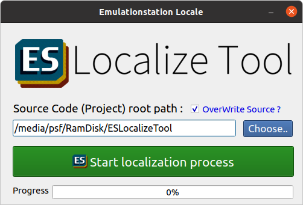

# EmulationStation Source Code Localized Tool

A powerful tool that modify ES (EmulationStation) source code to support localization. Easy to use and support the lastest ES version.




## Precheck ES source code compile environment

Only for Linux base.

- Download dependencies of packages.
```
sudo apt-get update
sudo apt-get dist-upgrade
sudo apt-get install git
sudo apt-get install libsdl2-dev libfreeimage-dev libfreetype6-dev libcurl4-openssl-dev rapidjson-dev \
  libasound2-dev libgles2-mesa-dev build-essential cmake fonts-droid-fallback libvlc-dev \
  libvlccore-dev vlc-bin
```

- Resolve dependencies of libraries.
```
sudo apt-get install -y libboost-system-dev libboost-filesystem-dev libboost-date-time-dev libboost-locale-dev libfreeimage-dev libfreetype6-dev libeigen3-dev libcurl4-openssl-dev libasound2-dev cmake libsdl2-dev gettext
```

**Suggestion :** You must confirm if it's possible to compile ES source code in your system. Please check [Retropie official tutorial](https://github.com/RetroPie/EmulationStation).

## Prepare for this Tool

This tool was based on python 3 and support cross-platform.

- Install Python 3 runtime on your system. Python version >= 3.8+ recommend.
- Install `PyQt5` via your favorite method, ex:

**For Windows / macOS users:**

```
pip install -v pyqt5
```
or **For Linux base users:**

```
sudo apt install python3-pyqt5 
```

- Download this code:
```
git clone https://github.com/benjenq/ESLocalizeTool.git
```

- Launch.

```
cd ESLocalizeTool
python3 ESLocalize.py
```

## How to use

- Download ES source code from [Retropie official repository on Github](https://github.com/RetroPie/EmulationStation).
- Choose ES source code folder.
- Click `Start localization process` button. The process will go through in few seconds. (Not more then 5 seconds usually.)
- When the process finished, it will popup ES compiled command scripts. Choose what you need (Linux / Raspberry) and click `Copy`.

- If you check `Overwrite source ?`, you can direct to ES source code folder. Just paste the scripts to compile ES. 
- If you don't check `Overwrite source ?`, you will got a new folder name `output` in the same location as ES source code folder (NOT under ES source code folder). It's all modified ES source code. You can compare the different, or just overwrite back to ES source code mamually.

```
<workspace folder>
    |--- EmulationStation
    |--- output
```


**Notice :** Although it support cross-flatform, but you must compile ES code in linux base OS.

- When ES compile finished, you will got a new binary file `emulationstation` in EmulationStation source code folder. Just run or copy this binary to the default location (`/opt/retropie/supplementary/emulationstation/`):
```
sudo cp ./emulationstation /opt/retropie/supplementary/emulationstation/
sudo cp -r locale /opt/retropie/supplementary/emulationstation/
```

## Supplemental Instruction

1. If your python version is 3.7.x or less, you will got `Limited functionality` warrning. You can not enable and check `Overwrite source` because old python command `copytree` and `rmtree` is not compatible.

2. You can use `pyinstaller` command to create direct executable file:
```
pyinstaller ESLocalied.spec
```
or download executable file from [`Release`](https://github.com/benjenq/ESLocalizeTool/releases) tab.

3. When localization process finished, A file `reports.txt` created ( located in the ES source directory when check `Overwrite source ?` or under output folder). You could see from `reports.txt` which code of files has been modified.

## Author

[benjenq](https://github.com/benjenq)

## Credits

Thanks to:

* [flyinghead](https://github.com/flyinghead) - For source code reference & the French translations.
* [heloisa](https://github.com/heloisatech) - For the Portuguese (Brazilian) and Spanish (Spain) translations.
* [wakaya](https://retropie.org.uk/forum/user/wakaya) - For the Japanese translations and for the instructions on how to use the localized EmulationStation.
* [hiulit](https://github.com/hiulit) - For the Catalan and Spanish (Spain) translations.
* [Taranchul](https://github.com/Taranchul) - For the German translations.
* Unknown - For the Italian translations.
* [losernator](https://github.com/losernator) - For the Korean translations.


